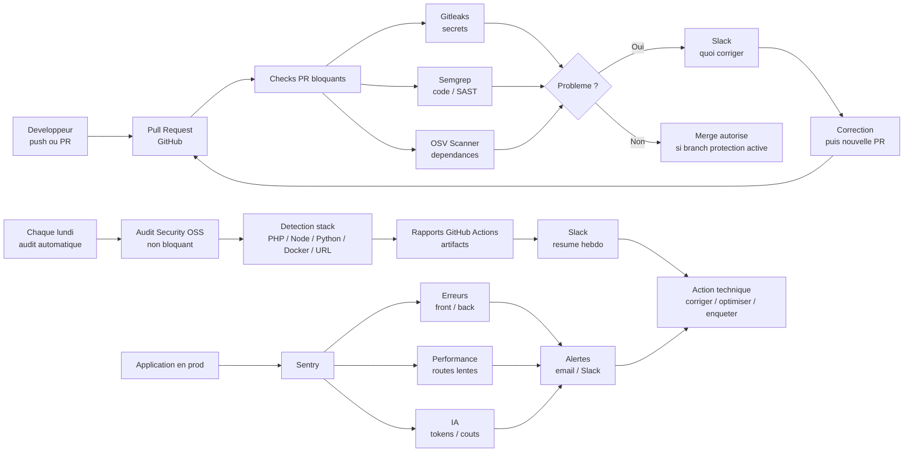

# Process Simple De Securite Et Monitoring Applicatif

Ce document resume le process que l'on veut mettre en place sur nos applications internes.

L'objectif est simple : avoir un socle commun, facile a copier d'une app a l'autre, qui permet de detecter rapidement les problemes de securite, les erreurs applicatives et les comportements anormaux.

Le process repose sur deux piliers complementaires :

```text
1. GitHub Actions Security OSS
   Controle le code, les dependances et l'exposition web.

2. Sentry
   Surveille l'application une fois qu'elle tourne vraiment.
```

## Vue D'Ensemble Visuelle

Le process peut se lire comme une chaine simple : on controle avant merge, on audite chaque semaine, puis on surveille l'application en production.



Version ultra simple :

```text
PR ouverte
  -> Gitleaks / Semgrep / OSV
  -> si probleme: Slack + correction
  -> si OK: merge

Chaque lundi
  -> audit complet Security OSS
  -> rapport GitHub Actions + Slack

Production
  -> Sentry surveille erreurs, lenteurs, couts IA
  -> alertes quand quelque chose sort de la normale
```

## Pourquoi Mettre Ce Process En Place

Aujourd'hui, nos applications utilisent plusieurs stacks : PHP, Python, React, APIs, outils internes, integrations IA, services externes.

Le risque principal n'est pas seulement "avoir une grosse faille visible". Les problemes peuvent aussi venir de choses plus discretes :

```text
une cle API commitee par erreur
une dependance qui devient vulnerable
une route admin mal protegee
une erreur utilisateur non vue par l'equipe
un appel IA qui coute trop cher
un endpoint qui devient tres lent
un service utilise de maniere anormale
```

Le but du process est donc d'avoir une surveillance continue, sans attendre qu'un utilisateur remonte le probleme.

## Pilier 1 - Workflow Security OSS

Le workflow GitHub Actions est documente en detail ici :

```text
docs/security-oss-workflow.md
```

Son role est de controler le projet directement dans GitHub.

### Sur Chaque Pull Request

Le workflow lance des controles bloquants avant merge :

```text
Gitleaks
Semgrep
OSV Scanner
```

Ces outils verifient :

```text
Gitleaks    -> secrets, tokens, cles API, fichiers sensibles
Semgrep     -> erreurs de code et patterns de securite
OSV Scanner -> dependances vulnerables connues
```

Interet :

```text
eviter de merger une faille evidente
eviter de merger un secret
detecter rapidement une dependance dangereuse
forcer une correction avant que le code parte plus loin
```

Si un probleme est detecte, le workflow echoue et envoie un message Slack avec :

```text
la PR concernee
le job en echec
le lien vers GitHub Actions
les fichiers ou packages concernes quand les rapports sont disponibles
les actions concretes a faire
```

Important : pour que le merge soit vraiment bloque, il faut activer les branch protection rules GitHub et rendre les checks obligatoires.

### Chaque Lundi

Le workflow lance aussi un audit hebdomadaire.

Cet audit est non bloquant. Son objectif n'est pas de casser le projet, mais de produire un rapport lisible.

Il peut lancer selon la stack :

```text
Gitleaks
Semgrep
OSV Scanner
Composer audit
npm audit
pip-audit
Trivy
OWASP ZAP
Supabomb
```

Le workflow detecte automatiquement les fichiers presents :

```text
composer.lock       -> audit PHP
package-lock.json   -> audit Node
requirements*.txt   -> audit Python
Dockerfile          -> audit Docker
SECURITY_TARGET_URL -> scan web ZAP et Supabomb
```

Interet :

```text
un seul template reutilisable sur toutes les apps
pas besoin de savoir a l'avance si l'app est PHP, Python ou React
les scans inutiles sont ignores proprement
un rapport Slack arrive chaque semaine
les rapports detailles sont gardes dans les artifacts GitHub Actions
```

### Analyse IA Optionnelle

Si une cle OpenAI est configuree dans GitHub Secrets, le workflow ajoute une synthese IA dans le rapport Slack.

L'IA ne remplace pas les outils de securite. Elle sert surtout a rendre le rapport plus lisible :

```text
resume des problemes importants
priorisation des actions
explication en francais
recommandations concretes
```

Si la cle OpenAI n'est pas configuree, le workflow fonctionne quand meme. Il envoie simplement le rapport sans synthese IA.

## Pilier 2 - Sentry

Sentry sert a surveiller l'application en execution.

La difference avec le workflow GitHub est importante :

```text
GitHub Actions controle le code avant ou pendant la maintenance.
Sentry surveille ce qui se passe quand l'application tourne.
```

Sentry permet de detecter :

```text
erreurs serveur
erreurs navigateur
routes lentes
exceptions non gerees
regressions apres deploiement
problemes sur une fonctionnalite precise
couts ou tokens eleves sur les apps IA
```

## A Quoi Sert Sentry Concretement

### 1. Detecter Les Erreurs Invisibles

Sans Sentry, une erreur peut arriver chez un utilisateur sans que l'equipe soit au courant.

Avec Sentry, une erreur remonte avec :

```text
le message d'erreur
la stack trace
l'environnement
la page ou route concernee
le navigateur ou serveur concerne
le moment exact
le nombre d'utilisateurs touches
```

Interet :

```text
detecter vite
comprendre plus vite
corriger plus vite
```

### 2. Suivre La Performance

Sentry peut tracer les requetes et les spans.

Exemple sur une application IA :

```text
/chat total
appel LLM
recherche documentaire
reranking
sauvegarde en base
```

Cela permet de savoir pourquoi une requete est lente.

Sans traces, on sait seulement :

```text
le chat a pris 30 secondes
```

Avec les spans, on peut voir :

```text
25 secondes viennent du modele IA
4 secondes viennent de la recherche documentaire
1 seconde vient de la base de donnees
```

Interet :

```text
ne pas deviner
identifier le vrai point lent
prioriser les optimisations utiles
```

### 3. Monitorer Les Couts IA

Pour les apps qui utilisent des modeles IA, Sentry peut recevoir des metriques applicatives :

```text
tokens input
tokens output
tokens total
cout estime
modele utilise
temps de generation
```

Cela permet de creer des alertes du type :

```text
une generation coute anormalement cher
un chat consomme trop de tokens
une route IA devient trop lente
```

Interet :

```text
eviter les surprises de cout
detecter un prompt trop long
detecter une boucle ou un usage anormal
comparer les modeles entre eux
```

### 4. Etre Notifie Automatiquement

Sentry peut envoyer des alertes par email ou Slack.

Exemples de monitors utiles :

```text
nouvelle erreur critique
volume d'erreurs anormal
latence p95 trop elevee sur une route cle
endpoint healthcheck indisponible
cout IA anormal
tokens anormalement eleves
```

Interet :

```text
l'equipe est informee sans aller verifier manuellement
les alertes restent ciblees
on evite d'avoir 50 notifications inutiles
```

## Process Standard A Mettre Sur Chaque App

### Etape 1 - Ajouter Le Workflow Security OSS

Ajouter le fichier :

```text
.github/workflows/security-oss.yml
```

Configurer au minimum :

```text
SLACK_WEBHOOK_URL
```

Optionnel :

```text
OPENAI_API_KEY
OPENAI_SECURITY_MODEL
SECURITY_TARGET_URL
```

### Etape 2 - Activer La Protection De Branche

Dans GitHub :

```text
Settings
Branches
Branch protection rule
Require status checks to pass before merging
```

Checks a rendre obligatoires :

```text
PR Security - Secrets + SAST
PR Security - OSV Scanner
```

Sans cette protection, le workflow peut echouer mais GitHub peut quand meme laisser merger.

### Etape 3 - Installer Sentry Dans L'Application

Selon la stack :

```text
PHP    -> sentry/sentry via Composer
Python -> sentry-sdk
React  -> @sentry/react
Node   -> @sentry/node
```

Configurer :

```text
SENTRY_DSN
SENTRY_ENVIRONMENT
SENTRY_TRACES_SAMPLE_RATE
```

### Etape 4 - Ajouter Les Monitors Sentry Minimum

Pour une app classique :

```text
New error issue
Error volume high
Endpoint healthcheck down si URL publique
Route principale trop lente
```

Pour une app IA :

```text
Generation trop lente
Cout generation inhabituel
Tokens generation inhabituels
Erreur fournisseur IA
```

### Etape 5 - Routine De Maintenance

Chaque PR :

```text
les checks securite doivent passer avant merge
les erreurs Slack doivent etre corrigees ou justifiees
```

Chaque lundi :

```text
lire le rapport Slack Security OSS
ouvrir les artifacts si un outil remonte un probleme
traiter en priorite secrets, critical et high
```

Au fil de l'eau :

```text
surveiller les alertes Sentry
corriger les erreurs recurrentes
optimiser les routes lentes
surveiller les couts IA
```

## Ce Que Ce Process Apporte

Pour l'equipe technique :

```text
moins de detection manuelle
plus de visibilite
des alertes actionnables
un process commun entre les apps
```

Pour le responsable :

```text
meilleure maitrise du risque
suivi regulier
preuves d'audit via artifacts GitHub
alertes en cas de probleme
process reproductible sur les nouveaux projets
```

Pour les utilisateurs :

```text
moins d'erreurs invisibles
corrections plus rapides
applications plus stables
meilleure fiabilite des outils internes
```

## Ce Que Le Process Ne Remplace Pas

Ce process ne remplace pas :

```text
un pentest manuel complet
une revue d'architecture securite
une revue des droits utilisateurs
une analyse metier avancee
des tests de roles authentifies
```

Il donne un socle continu, simple et efficace. Pour les apps critiques, il faut le completer par une revue manuelle periodique.

## Synthese

Le process propose est volontairement simple :

```text
Avant merge  -> GitHub Actions bloque les problemes evidents.
Chaque lundi -> GitHub Actions audite et envoie un rapport Slack.
En production -> Sentry surveille les erreurs, la performance et les couts.
```

Cela permet d'industrialiser une base de securite et monitoring sur chaque application sans construire un dispositif lourd.

L'idee n'est pas d'avoir un outil parfait, mais d'avoir un filet de securite permanent, lisible, et facile a deployer sur tous les projets.
